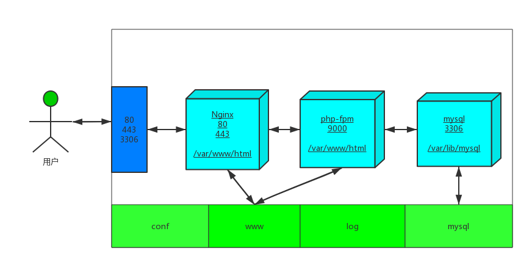

# Lnmp

Docker开发环境：Nginx MySQL  Redis PHP5.4  PHP5.6 PHP7.2 支持xdebug 

下图是这个Docker下的开发环境的结构 



### 特点
1. 完全开源
2. 支持多版本PHP切换（PHP5.4、PHP5.6、PHP7.2...)
3. 支持绑定任意多个域名
4. 支持HTTPS和HTTP/2
5. PHP源代码位于host中
6. MySQL data位于host中
7. 所有配置文件可在host中直接修改
8. 所有日志文件可在host中直接查看
9. 内置完整PHP扩展安装命令
10. 实现一次配置，Windows、Linux、MacOs皆可用

### 使用
1. 根据系统Linux,MacOS 安装 `docker` and `docker-compose`;
2. lnmp.tar为全部的Docker lnmp images文件，使用Docker加载images 
    
```
$docker load -i lnmp.tar 
$dcoker images 
REPOSITORY          TAG                 IMAGE ID            CREATED             SIZE
lnmp_php-5.6        latest              5058dd413ff1        2 days ago          685MB
lnmp_php-5.4        latest              3d5f34a10142        2 days ago          854MB
lnmp_php-7.2        latest              c44343fb86f1        2 days ago          739MB
nginx               alpine              2dea9e73d89e        6 days ago          18MB
redis               latest              c5355f8853e4        13 days ago         107MB
mysql               latest              5195076672a7        3 weeks ago         371MB


```
可以看到多个image文件已经load进入Docker
4. 启动docker容器:

```
 $docker-compose -f docker-compose-lnmp.yml up -d 
 $docker ps 
    
CONTAINER ID        IMAGE                 COMMAND                  CREATED             STATUS              PORTS                                      NAMES
9f0d62123d9b        nginx:alpine          "nginx -g 'daemon ofΒ   10 minutes ago      Up 10 minutes       0.0.0.0:80->80/tcp, 0.0.0.0:443->443/tcp   lnmp_nginx_1
a29c79eda632        lnmp_php-7.2:latest   "docker-php-entrypoiΒ   10 minutes ago      Up 10 minutes       9000/tcp                                   lnmp_php-7.2_1
f0ae150c249b        lnmp_php-5.6:latest   "docker-php-entrypoiΒ   10 minutes ago      Up 10 minutes       9000/tcp                                   lnmp_php-5.6_1
fcd1d0e37b9c        lnmp_php-5.4:latest   "php-fpm"                10 minutes ago      Up 10 minutes       9000/tcp                                   lnmp_php-5.4_1
d155fbb9f5c8        redis:latest          "docker-entrypoint.sΒ   10 minutes ago      Up 10 minutes       0.0.0.0:6379->6379/tcp                     lnmp_redis_1
2c40800cda39        mysql:latest          "docker-entrypoint.sΒ   10 minutes ago      Up 10 minutes       0.0.0.0:3306->3306/tcp                     lnmp_mys

```   

可以看到容器已经启动了。
    
5. 在浏览其中localhost:


###切换不同的PHP版本
编辑 ./conf/nginx/conf.d/www.site1.conf 文件

```
   location ~ \.php$ {
        fastcgi_pass   fpm-7.2:9000;
        fastcgi_index  index.php;
        include        fastcgi_params;
        fastcgi_param  SCRIPT_FILENAME  $document_root$fastcgi_script_name;
    }
    
```

修改为：

```
location ~ \.php$ {
        fastcgi_pass   fpm-5.6:9000;
        fastcgi_index  index.php;
        include        fastcgi_params;
        fastcgi_param  SCRIPT_FILENAME  $document_root$fastcgi_script_name;
    }
```
nginx 重新加载配置文件

```
$docker exec -it  <container_id>  nginx -s reload 	
```

###重新启动php-fpm 
在PHP容器中php-fpm进程pid 为1 
```
$docker exec -it  <container_id>  kill  -USR1 1	
```