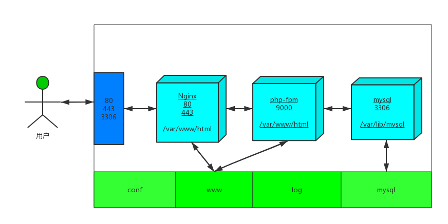
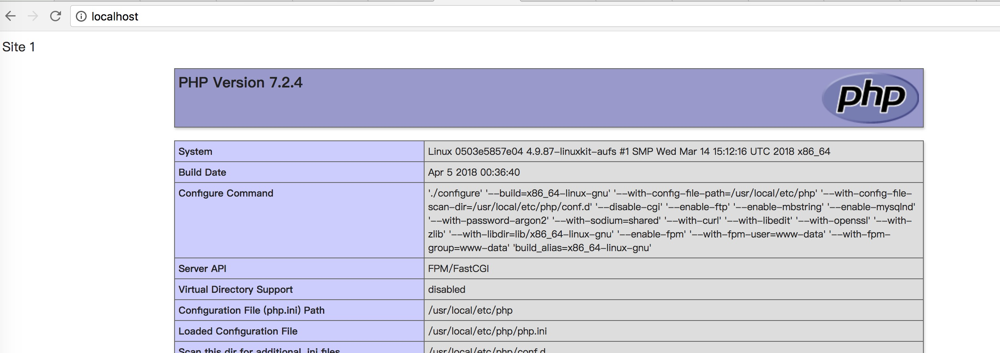

# DNMP
Docker deploying Nginx MySQL PHP5.4 PHP5.6 PHP7.2  in on compose file, support full feature functions.



### Feature
1. Completely open source.
2. Support Multiple PHP version(PHP5.4, PHP5.6, PHP7.2) switch.
3. Support Multiple domains.
4. Support HTTPS and HTTP/2.
5. PHP source located in host.
6. MySQL data directory in host.
7. All conf files located in host.
8. All log files located in host.
9. Built-in PHP extensions install commands.
10. Promise 100% available.
11. Supported any OS with docker.

### Usage
1. Install `git`, `docker` and `docker-compose`;
2. Clone project:
    ```
    $ git clone https://github.com/heguangzhi/dnmp.git
    ```
4.  Build php5.4 php5.6 php7.2 :
    ```
    $ cd dnmp
    $ docker-compose build 
    ```
    You may need use `sudo` before this command in Linux.
5. Start docker containers:
   
   ```
   $ docker-compose -f  docker-compose.yml up -d 
   ```
   
6. Go to your browser and type `localhost`, you will see:



The index file is located in `./www/www.site1.com/`.

### Other PHP version?
Default, we start LATEST PHP version by using:
```
$ docker-compose up
```

We need not change any other files, such as nginx config file or php.ini, everything will work fine in current environment (except code compatibility error).

> Notice: We can only start one php version, for they using same port. We must STOP the running project then START the other one.

### HTTPS and HTTP/2
Default demo include 2 sites:
* http://www.site1.com (same with http://localhost)
* https://www.site2.com

To preview them, add 2 lines to your hosts file (at `/etc/hosts` on Linux and `C:\Windows\System32\drivers\etc\hosts` on Windows):
```
127.0.0.1 www.site1.com
127.0.0.1 www.site2.com
```
Then you can visit from browser.
